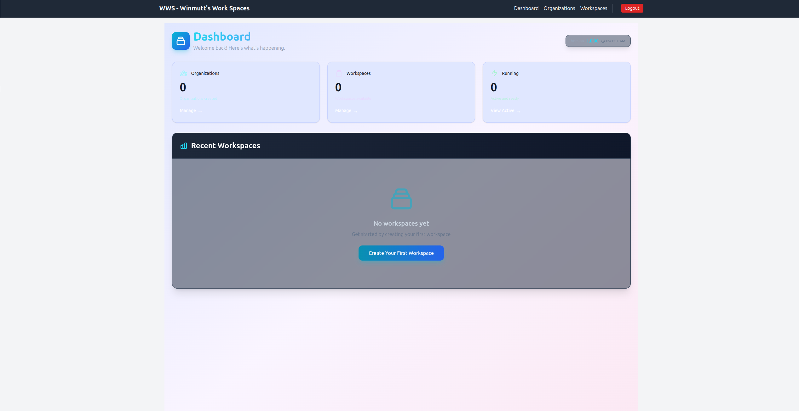

# Winmutt's Work Spaces (WWS)

A remote workspace provisioning system for engineering organizations. Spin up isolated development environments on-demand, manage their lifecycle, and connect via remote editors.

## Overview

WWS enables engineering teams to create, manage, and destroy isolated development workspaces for ticket-based development workflows. Each workspace is a self-contained environment with persistent storage, pre-configured language tooling, and remote editing capabilities.

## Dashboard Screenshot



## Key Features

- **Isolated Workspaces** - KVM/Podman-based environments with resource quotas
- **Persistent Storage** - Home directory preserved across restarts
- **Remote Editing** - code-server (VSCode) integration
- **Language Support** - Python, JavaScript, Go, Rust (extensible)
- **Dotfiles Management** - yadm for configuration synchronization
- **GitHub Integration** - Clone repos or create new ones, credentials injected
- **Bootstrap Scripts** - Custom initialization logic
- **Team Collaboration** - Organization management, shared access, RBAC
- **Idle Management** - Auto-shutdown after configurable timeout (4-8 hours default)

## Architecture

```
┌─────────────────────────────────────────────────────────┐
│                     Web Management UI                   │
│              (React - Create React App)                 │
└─────────────────────────────────────────────────────────┘
                            │
                            ▼
┌─────────────────────────────────────────────────────────┐
│                  Go Backend API                         │
│              SQLite (Metadata Storage)                  │
└─────────────────────────────────────────────────────────┘
                            │
        ┌───────────────────┼───────────────────┐
        ▼                   ▼                   ▼
┌─────────────────┐ ┌─────────────────┐ ┌─────────────────┐
│   KVM Provider  │ │  Podman Runtime │ │  DigitalOcean   │
│   (Local VMs)   │ │  (Containers)   │ │  (Future)       │
└─────────────────┘ └─────────────────┘ └─────────────────┘
                            │
                            ▼
        ┌────────────────────────────────┐
        │    Workspace Agent (Inside)    │
        │  - Zsh shell                   │
        │  - yadm dotfiles              │
        │  - code-server                │
        │  - Bootstrap scripts          │
        │  - GitHub credentials         │
        └────────────────────────────────┘
```

## Project Structure

```
wws/
├── api/                    # Go backend API
│   ├── handlers/          # HTTP request handlers
│   ├── middleware/        # Auth, RBAC, logging
│   └── models/            # Database models
├── provisioner/           # Provider abstraction layer
│   ├── podman/            # Podman container runtime
│   ├── kvm/               # KVM virtualization
│   └── digitalocean/      # Cloud droplets (future)
├── workspace-agent/       # Runs inside each workspace
│   ├── init/              # Bootstrap scripts
│   ├── dotfiles/          # Yadm configuration
│   ├── editors/           # Editor servers
│   └── credentials/       # GitHub token management
├── languages/             # Language support modules
│   ├── python/
│   ├── javascript/
│   ├── go/
│   └── rust/
├── web/                   # React frontend
│   ├── public/
│   ├── src/
│   └── package.json
├── scripts/               # Provisioning & management scripts
├── docs/                  # Documentation
│   ├── ARCHITECTURE.md
│   └── specs/
└── tests/
```

## Tech Stack

| Layer | Technology |
|-------|-----------|
| Backend | Go (net/http, gin) |
| Frontend | React (Create React App) + Tailwind CSS |
| Database | SQLite (MVP) |
| Container | Podman / Docker |
| VM | KVM/QEMU |
| Shell | Zsh |
| Dotfiles | yadm |
| Editor | code-server (VSCode) |
| Authentication | GitHub OAuth2 |
| CSS | Tailwind CSS + PostCSS + Autoprefixer |

## Getting Started

### Prerequisites

- Docker or Podman (version 4.0+)
- Docker Compose or Podman Compose
- KVM support (Linux kernel with KVM module) - optional for container-only mode
- GitHub OAuth App (create at https://github.com/settings/developers)
- Node.js 18+ (for local development only)

### Quick Start with Docker/Podman Compose

**Step 1: Clone and Configure**

```bash
# Clone repository
git clone https://github.com/yourorg/wws.git
cd wws

# Configure environment variables (required for Docker/Podman)
export GITHUB_CLIENT_ID=your_github_client_id
export GITHUB_CLIENT_SECRET=your_github_client_secret
export GITHUB_CALLBACK_URL=http://localhost:8080/oauth/callback
export CORS_ORIGINS=http://localhost:3000,http://127.0.0.1:3000
export DATABASE_PATH=/data/wws.db
export STORAGE_PATH=/data

# Create data directory
mkdir -p data
```

**Step 2: Build and Start Services**

**Using Docker:**
```bash
# Build and start all services
docker-compose build
docker-compose up -d

# View logs
docker-compose logs -f

# Stop services
docker-compose down
```

**Using Podman:**
```bash
# Build and start all services
podman compose build
podman compose up -d

# View logs
podman compose logs -f

# Stop services
podman compose down
```

**Access the application:**
- Frontend: http://localhost:3000
- Backend API: http://localhost:8080

### Important Notes

**Tailwind CSS Build Requirements:**
The frontend requires proper PostCSS configuration for Tailwind CSS to work. Required files:
- `postcss.config.js` - PostCSS configuration with Tailwind and Autoprefixer
- `tailwind.config.js` - Tailwind configuration
- `index.css` - Must be imported in `index.tsx` with `import './index.css'`

**Custom API URL:**
When building the web container, specify the API URL:
```bash
podman build --build-arg REACT_APP_API_URL=http://your-server:8080/api/v1 -t wws-web -f web/Dockerfile web
```

### Configuration

**Environment Variables (Required for Docker/Podman):**

Set these before running containers:
```bash
# GitHub OAuth (required)
export GITHUB_CLIENT_ID=your_github_client_id
export GITHUB_CLIENT_SECRET=your_github_client_secret
export GITHUB_CALLBACK_URL=http://your-server:8080/oauth/callback

# CORS origins (comma-separated)
export CORS_ORIGINS=http://your-server:3000,http://localhost:3000

# Database and storage paths
export DATABASE_PATH=/data/wws.db
export STORAGE_PATH=/data

# Optional: Workspace defaults
export WORKSPACE_IDLE_TIMEOUT_HOURS=6
export WORKSPACE_DEFAULT_STORAGE_GB=20
export WORKSPACE_DEFAULT_CPU=2
export WORKSPACE_DEFAULT_MEMORY_GB=4

# Frontend API URL (for web container build)
export REACT_APP_API_URL=http://your-server:8080/api/v1
```

**Note:** Create a GitHub OAuth application at https://github.com/settings/developers and set the callback URL to `http://your-server:8080/oauth/callback`.

**Option 2: Config File (For local development)**

Create `api/config.yaml`:
```yaml
server:
  port: 8080
  cors:
    origins: ["http://localhost:3000"]

database:
  path: "./data/wws.db"

github:
  client_id: "your_github_oauth_client_id"
  client_secret: "your_github_oauth_client_secret"
  callback_url: "http://localhost:8080/oauth/callback"

workspaces:
  idle_timeout_hours: 6
  default_storage_gb: 20
  default_cpu: 2
  default_memory_gb: 4
```

## Usage

### For Users

1. **Login** - Authenticate with GitHub
2. **Create Workspace** - Select organization, provide repo URL (or create new), assign unique tag
3. **Configure** - Choose languages, editor preferences
4. **Start Workspace** - Workspace provisions via Podman/KVM
5. **Connect** - Use code-server or SSH to access
6. **Work** - Develop on your ticket/issue
7. **Stop/Destroy** - When done, stop or destroy workspace

### For Administrators

1. **Create Organization** - Manage team structure
2. **Invite Users** - Add team members
3. **Monitor** - View workspace usage, resource consumption
4. **Configure** - Set idle timeouts, quotas, templates
5. **Audit** - Review action logs

## Troubleshooting

**Frontend shows no styles:**
- Ensure `postcss.config.js` exists with Tailwind and Autoprefixer plugins
- Verify `tailwind.config.js` is configured
- Check that `index.css` is imported in `index.tsx`
- Rebuild the web container after fixing configuration files

**API fails to start:**
- Verify all required environment variables are set
- Check that `/data` directory exists and is writable
- Ensure port 8080 is not in use

**Database errors:**
- Ensure `DATABASE_PATH` environment variable is set correctly
- Check volume mount permissions for data directory

## Security Considerations

- GitHub OAuth2 authentication
- RBAC for organization/workspace permissions
- Network isolation between workspaces
- Encrypted storage (Phase 2)
- Audit logging for all operations
- Resource quotas per workspace/user
- Auto-expiring credentials

## Roadmap

### Phase 1 (MVP)
- GitHub OAuth authentication
- Organization + team management
- KVM + Podman provisioning
- Workspace CRUD operations
- code-server integration
- Zsh + yadm dotfiles
- Bootstrap script execution
- Language checklist

### Phase 2 (Current - Team Features) ✅ Complete
- [x] Shared workspace access
- [x] Team-based permissions
- [x] Resource monitoring dashboard
- [x] Workspace templates
- [x] Usage analytics
- [x] Backup/restore
- [x] Encrypted storage
- [x] Tmux session sharing
- [x] Shared terminal
- [x] Workspace export/import
- [x] Idle timeout management
- [x] Comprehensive E2E test suite

### Phase 3
- DigitalOcean droplet support
- Kubernetes orchestration
- Additional editors (Cursor, IntelliJ)
- More language runtimes
- Custom provisioning plugins

## Contributing

1. Fork repository
2. Create feature branch (`git checkout -b feature/amazing-feature`)
3. Commit changes (`git commit -m 'Add amazing feature'`)
4. Push branch (`git push origin feature/amazing-feature`)
5. Open Pull Request

## License

MIT License - see LICENSE file for details

## Acknowledgments

- [code-server](https://github.com/coder/code-server) - VSCode in browser
- [yadm](https://github.com/yadm-dev/yadm) - Yet Another Dotfiles Manager
- [Podman](https://podman.io) - Container runtime
- [KVM](https://www.linux-kvm.org) - Kernel-based Virtual Machine
